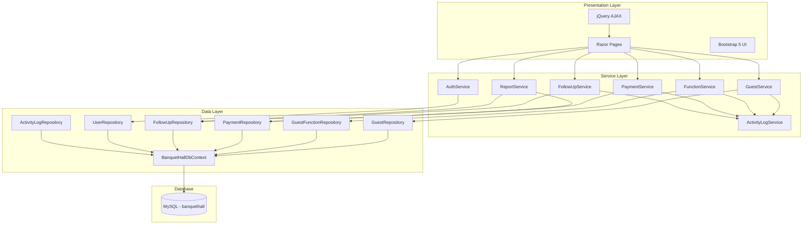
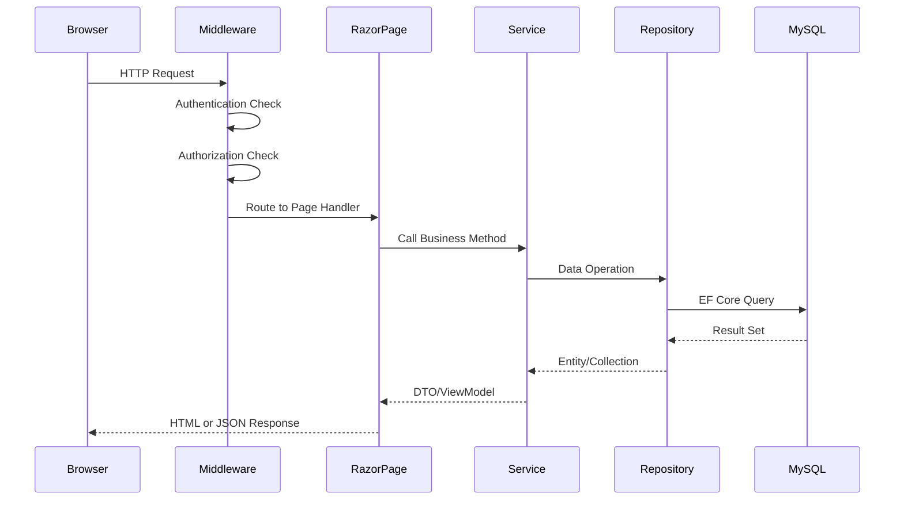

    # Design Document: Banquet Hall Management System

## Overview

The Banquet Hall Management System is an ASP.NET Core 9 Razor Pages application that provides guest management, function booking, payment tracking, follow-up management, and business reporting for banquet halls. The system connects to an existing MySQL database and implements role-based access for Admin, Manager, and Receptionist users.

The architecture follows a layered approach: Data Layer (EF Core + Repositories) → Service Layer (Business Logic) → Presentation Layer (Razor Pages + AJAX). Authentication uses cookie-based claims with role authorization. The booking workflow is implemented as a multi-step AJAX wizard to avoid full page reloads.

### Key Design Decisions

1. **Database-First with no migrations**: The MySQL schema already exists. EF Core models map to existing tables using `[Table]` attributes and Fluent API configuration. No migrations are applied.
2. **Repository Pattern**: One repository per table abstracts data access. Repositories expose `IQueryable` for flexible querying by services.
3. **Cookie Authentication over ASP.NET Identity**: Since the Users table already exists with a simple structure, we use manual cookie authentication with `BCrypt.Net` for password hashing rather than the full ASP.NET Identity framework.
4. **AJAX Wizard via Razor Page Handlers**: Each wizard step posts to a named handler (`OnPostStepXAsync`) that returns JSON. jQuery manages step transitions client-side.
5. **Activity Logging via Service Decorator**: All loggable actions pass through an `IActivityLogService` that writes to the `ActivityLogs` table.

## Architecture



### Request Flow



## Components and Interfaces

### Data Layer

#### DbContext

```csharp
// Data/BanquetHallDbContext.cs
public class BanquetHallDbContext : DbContext
{
    public DbSet<Guest> Guests { get; set; }
    public DbSet<GuestFunction> GuestFunctions { get; set; }
    public DbSet<Payment> Payments { get; set; }
    public DbSet<FollowUp> FollowUps { get; set; }
    public DbSet<User> Users { get; set; }
    public DbSet<ActivityLog> ActivityLogs { get; set; }
}
```

#### Repository Interfaces

```csharp
// Repositories/IRepository.cs
public interface IRepository<T> where T : class
{
    Task<T?> GetByIdAsync(int id);
    Task<IEnumerable<T>> GetAllAsync();
    IQueryable<T> Query();
    Task AddAsync(T entity);
    void Update(T entity);
    Task SaveChangesAsync();
}

// Repositories/IGuestRepository.cs
public interface IGuestRepository : IRepository<Guest>
{
    Task<IEnumerable<Guest>> SearchAsync(string term, int maxResults = 10);
}

// Repositories/IGuestFunctionRepository.cs
public interface IGuestFunctionRepository : IRepository<GuestFunction>
{
    Task<IEnumerable<GuestFunction>> GetByGuestIdAsync(int guestId);
    Task<GuestFunction?> FindByAadhaarAsync(string aadhaar);
}

// Repositories/IFollowUpRepository.cs
public interface IFollowUpRepository : IRepository<FollowUp>
{
    Task<IEnumerable<FollowUp>> GetByManagerIdAsync(int managerId);
    Task<IEnumerable<FollowUp>> GetActiveByManagerIdAsync(int managerId);
    Task<FollowUp?> GetLatestByGuestIdAsync(int guestId);
}

// Repositories/IPaymentRepository.cs
public interface IPaymentRepository : IRepository<Payment>
{
    Task<IEnumerable<Payment>> GetByGuestIdAsync(int guestId);
    Task<IEnumerable<Payment>> GetByDateRangeAsync(DateTime from, DateTime to);
}

// Repositories/IUserRepository.cs
public interface IUserRepository : IRepository<User>
{
    Task<User?> GetByUsernameAsync(string username);
    Task<bool> UsernameExistsAsync(string username);
    Task<IEnumerable<User>> GetByRoleAsync(string role);
}

// Repositories/IActivityLogRepository.cs
public interface IActivityLogRepository : IRepository<ActivityLog>
{
    Task<IEnumerable<ActivityLog>> GetFilteredAsync(int? userId, string? actionType, string? entityType, DateTime? from, DateTime? to);
}
```

### Service Layer

```csharp
// Services/IAuthService.cs
public interface IAuthService
{
    Task<User?> ValidateCredentialsAsync(string username, string password);
    Task<ClaimsPrincipal> CreateClaimsPrincipalAsync(User user);
    string HashPassword(string password);
    bool VerifyPassword(string password, string hash);
}

// Services/IGuestService.cs
public interface IGuestService
{
    Task<Guest> CreateGuestAsync(GuestCreateDto dto, int managerId);
    Task<Guest> UpdateGuestAsync(int guestId, GuestUpdateDto dto, int userId);
    Task<IEnumerable<GuestSearchResultDto>> SearchGuestsAsync(string term);
    Task<GuestDetailDto?> GetGuestDetailAsync(int guestId, string userRole);
}

// Services/IFunctionService.cs
public interface IFunctionService
{
    Task<GuestFunction> CreateFunctionAsync(FunctionCreateDto dto, string managerName);
    Task<IEnumerable<GuestFunction>> GetFunctionsByGuestAsync(int guestId);
}

// Services/IPaymentService.cs
public interface IPaymentService
{
    Task<Payment> CreatePaymentAsync(PaymentCreateDto dto, int userId);
    Task<PaymentSummaryDto> CalculatePaymentAsync(int guaranteedPacks, decimal pricePerPack, decimal advanceAmount);
}

// Services/IFollowUpService.cs
public interface IFollowUpService
{
    Task<FollowUp> CreateFollowUpAsync(FollowUpCreateDto dto, int managerId, int userId);
    Task<FollowUp> UpdateFollowUpAsync(int followUpId, FollowUpUpdateDto dto, int userId);
    Task<int> TransferLeadsAsync(int sourceManagerId, int targetManagerId, int adminUserId);
}

// Services/IReportService.cs
public interface IReportService
{
    Task<RevenueReportDto> GetRevenueReportAsync(DateRangeFilter filter);
    Task<ManagerReportDto> GetManagerReportAsync(int managerId, DateRangeFilter filter);
    Task<IEnumerable<FollowUpMonitorDto>> GetFollowUpMonitorAsync(DateTime date);
    Task<decimal> CalculateConversionRateAsync(int managerId, DateTime from, DateTime to);
}

// Services/IActivityLogService.cs
public interface IActivityLogService
{
    Task LogAsync(int userId, string actionType, string entityType, int entityId, string? details = null);
    Task LogTransferAsync(int userId, int sourceManagerId, int targetManagerId, int leadsTransferred);
    Task<IEnumerable<ActivityLog>> GetLogsAsync(ActivityLogFilter filter);
}
```

### Presentation Layer - Razor Pages Structure

```
/Pages
├── _ViewImports.cshtml
├── _ViewStart.cshtml
├── Login.cshtml / Login.cshtml.cs
├── Logout.cshtml.cs
├── Error.cshtml / Error.cshtml.cs
├── /Admin
│   ├── Index.cshtml (Admin Dashboard)
│   ├── /Users
│   │   ├── Index.cshtml (User List)
│   │   ├── Create.cshtml
│   │   └── Edit.cshtml
│   ├── /Reports
│   │   ├── Revenue.cshtml
│   │   ├── ManagerWise.cshtml
│   │   └── FollowUpMonitor.cshtml
│   ├── /Leads
│   │   └── Transfer.cshtml
│   └── /ActivityLogs
│       └── Index.cshtml
├── /Manager
│   ├── Index.cshtml (Manager Dashboard)
│   ├── /Booking
│   │   └── Wizard.cshtml (Multi-step AJAX wizard)
│   ├── /Guests
│   │   ├── Index.cshtml (Guest List)
│   │   └── Edit.cshtml
│   ├── /FollowUps
│   │   ├── Index.cshtml
│   │   └── Edit.cshtml
│   └── /Reports
│       └── MyPerformance.cshtml
├── /Receptionist
│   ├── Index.cshtml (Receptionist Dashboard)
│   └── /Guests
│       ├── Index.cshtml (Search & View)
│       └── Details.cshtml
├── /Shared
│   ├── _Layout.cshtml
│   ├── _AdminLayout.cshtml
│   ├── _ManagerLayout.cshtml
│   ├── _ReceptionistLayout.cshtml
│   ├── _ValidationScriptsPartial.cshtml
│   ├── _BookingWizardStepIndicator.cshtml
│   └── _GuestSearchPartial.cshtml
└── /Api
    ├── GuestSearch.cshtml.cs (AJAX endpoint)
    └── Autofill.cshtml.cs (Smart autofill endpoint)
```

### API Endpoints (AJAX Handlers)

| Endpoint | Method | Purpose |
|----------|--------|---------|
| `/Manager/Booking/Wizard?handler=Step1` | POST | Save Guest, return GuestId |
| `/Manager/Booking/Wizard?handler=Step2` | POST | Save Function, return FunctionId |
| `/Manager/Booking/Wizard?handler=Step3` | POST | Save Payment, return PaymentId |
| `/Manager/Booking/Wizard?handler=Step4` | POST | Save FollowUp, return summary |
| `/Api/GuestSearch?handler=Search&term=X` | GET | Search guests (autofill) |
| `/Api/Autofill?handler=GuestDetail&id=X` | GET | Get full guest detail for autofill |

## Data Models

### Entity Models

```csharp
// Models/Guest.cs
[Table("Guests")]
public class Guest
{
    [Key]
    public int Id { get; set; }
    public DateTime CreatedAt { get; set; }

    [Required, MaxLength(150)]
    public string Name { get; set; } = string.Empty;

    [Required, MaxLength(20)]
    public string Mobile { get; set; } = string.Empty;

    [MaxLength(150)]
    public string? Email { get; set; }

    [MaxLength(150)]
    public string? ReferredByName { get; set; }

    [MaxLength(20)]
    public string? ReferredByPhone { get; set; }

    [MaxLength(50)]
    public string? Status { get; set; } // VIP, VVIP, Normal

    public int? InitiatedByManagerId { get; set; }

    // Navigation
    public ICollection<GuestFunction> Functions { get; set; } = new List<GuestFunction>();
    public ICollection<Payment> Payments { get; set; } = new List<Payment>();
    public ICollection<FollowUp> FollowUps { get; set; } = new List<FollowUp>();
}

// Models/GuestFunction.cs
[Table("GuestFunctions")]
public class GuestFunction
{
    [Key]
    public int Id { get; set; }
    public int GuestId { get; set; }
    public DateTime FunctionDate { get; set; }

    [MaxLength(100)]
    public string FunctionType { get; set; } = string.Empty; // Wedding, Reception

    [MaxLength(150)]
    public string MealPlan { get; set; } = string.Empty;

    [MaxLength(150)]
    public string? InitiatedBy { get; set; }

    public string? GuestAddress { get; set; }

    [MaxLength(20)]
    public string? GuestAadhaar { get; set; }

    public DateTime CreatedAt { get; set; }

    // Navigation
    public Guest Guest { get; set; } = null!;
    public ICollection<Payment> Payments { get; set; } = new List<Payment>();
}

// Models/Payment.cs
[Table("Payments")]
public class Payment
{
    [Key]
    public int Id { get; set; }
    public int GuestId { get; set; }
    public int FunctionId { get; set; }

    [MaxLength(50)]
    public string PaymentType { get; set; } = string.Empty; // Cash, UPI, Card

    [Column(TypeName = "decimal(18,2)")]
    public decimal Amount { get; set; }

    public int NoOfPacks { get; set; }
    public int GuaranteedPacks { get; set; }

    [Column(TypeName = "decimal(18,2)")]
    public decimal PricePerPack { get; set; }

    public bool AdvancePaid { get; set; }

    [Column(TypeName = "decimal(18,2)")]
    public decimal AdvanceAmount { get; set; }

    [Column(TypeName = "decimal(18,2)")]
    public decimal RemainingAmount { get; set; }

    public DateTime CreatedAt { get; set; }

    // Navigation
    public Guest Guest { get; set; } = null!;
    public GuestFunction Function { get; set; } = null!;
}

// Models/FollowUp.cs
[Table("FollowUps")]
public class FollowUp
{
    [Key]
    public int Id { get; set; }
    public int GuestId { get; set; }
    public int ManagerId { get; set; }

    [MaxLength(50)]
    public string Status { get; set; } = string.Empty; // New, In Progress, Followup

    [MaxLength(50)]
    public string FollowupStatus { get; set; } = string.Empty; // May Close, May Not Close, Success, Failed

    public DateTime FollowupDate { get; set; }
    public string? Remarks { get; set; }
    public DateTime UpdatedAt { get; set; }

    // Navigation
    public Guest Guest { get; set; } = null!;
    public User Manager { get; set; } = null!;
}

// Models/User.cs
[Table("Users")]
public class User
{
    [Key]
    public int Id { get; set; }

    [Required, MaxLength(100)]
    public string Username { get; set; } = string.Empty;

    [Required]
    public string PasswordHash { get; set; } = string.Empty;

    [MaxLength(150)]
    public string FullName { get; set; } = string.Empty;

    [MaxLength(50)]
    public string Role { get; set; } = string.Empty; // Admin, Manager, Receptionist

    public bool IsActive { get; set; } = true;
    public DateTime CreatedAt { get; set; }

    // Navigation
    public ICollection<FollowUp> AssignedFollowUps { get; set; } = new List<FollowUp>();
}

// Models/ActivityLog.cs (New table)
[Table("ActivityLogs")]
public class ActivityLog
{
    [Key]
    public int Id { get; set; }
    public int UserId { get; set; }

    [MaxLength(100)]
    public string Username { get; set; } = string.Empty;

    [MaxLength(50)]
    public string ActionType { get; set; } = string.Empty; // Create, Update, Transfer

    [MaxLength(50)]
    public string EntityType { get; set; } = string.Empty; // Guest, GuestFunction, Payment, FollowUp

    public int? EntityId { get; set; }
    public string? Details { get; set; }
    public DateTime Timestamp { get; set; }

    // Navigation
    public User User { get; set; } = null!;
}
```

### View Models / DTOs

```csharp
// ViewModels/LoginViewModel.cs
public class LoginViewModel
{
    [Required] public string Username { get; set; } = string.Empty;
    [Required] public string Password { get; set; } = string.Empty;
}

// ViewModels/GuestCreateDto.cs
public class GuestCreateDto
{
    [Required, MaxLength(150)] public string Name { get; set; } = string.Empty;
    [Required, MaxLength(20)] public string Mobile { get; set; } = string.Empty;
    [MaxLength(150), EmailAddress] public string? Email { get; set; }
    [MaxLength(150)] public string? ReferredByName { get; set; }
    [MaxLength(20)] public string? ReferredByPhone { get; set; }
    public string? Status { get; set; } // VIP, VVIP, Normal
}

// ViewModels/FunctionCreateDto.cs
public class FunctionCreateDto
{
    [Required] public int GuestId { get; set; }
    [Required] public DateTime FunctionDate { get; set; }
    [Required] public string FunctionType { get; set; } = string.Empty;
    [Required] public string MealPlan { get; set; } = string.Empty;
    [Required] public string GuestAddress { get; set; } = string.Empty;
    [Required, StringLength(12, MinimumLength = 12)] public string GuestAadhaar { get; set; } = string.Empty;
}

// ViewModels/PaymentCreateDto.cs
public class PaymentCreateDto
{
    [Required] public int GuestId { get; set; }
    [Required] public int FunctionId { get; set; }
    [Required] public string PaymentType { get; set; } = string.Empty;
    [Range(1, int.MaxValue)] public int NoOfPacks { get; set; }
    [Range(1, int.MaxValue)] public int GuaranteedPacks { get; set; }
    [Range(0.01, double.MaxValue)] public decimal PricePerPack { get; set; }
    public bool AdvancePaid { get; set; }
    [Range(0, double.MaxValue)] public decimal AdvanceAmount { get; set; }
}

// ViewModels/FollowUpCreateDto.cs
public class FollowUpCreateDto
{
    [Required] public int GuestId { get; set; }
    [Required] public string Status { get; set; } = string.Empty;
    [Required] public string FollowupStatus { get; set; } = string.Empty;
    [Required] public DateTime FollowupDate { get; set; }
    [MaxLength(2000)] public string? Remarks { get; set; }
}

// ViewModels/GuestSearchResultDto.cs
public class GuestSearchResultDto
{
    public int Id { get; set; }
    public string Name { get; set; } = string.Empty;
    public string Mobile { get; set; } = string.Empty;
    public string? Email { get; set; }
    public string? Status { get; set; }
    public string? CurrentManager { get; set; }
    public string? InitiatedByManager { get; set; }
}

// ViewModels/PaymentSummaryDto.cs
public class PaymentSummaryDto
{
    public decimal Amount { get; set; }
    public decimal AdvanceAmount { get; set; }
    public decimal RemainingAmount { get; set; }
}

// ViewModels/RevenueReportDto.cs
public class RevenueReportDto
{
    public decimal TotalRevenue { get; set; }
    public int TotalBookings { get; set; }
    public DateTime FromDate { get; set; }
    public DateTime ToDate { get; set; }
    public IEnumerable<DailyRevenueDto> DailyBreakdown { get; set; } = new List<DailyRevenueDto>();
}

// ViewModels/DateRangeFilter.cs
public class DateRangeFilter
{
    public string FilterType { get; set; } = "Today"; // Today, ThisWeek, ThisMonth, FinancialYear, ExactDate, Custom
    public DateTime? ExactDate { get; set; }
    public DateTime? FromDate { get; set; }
    public DateTime? ToDate { get; set; }
}
```

### DbContext Configuration

```csharp
// Data/BanquetHallDbContext.cs
protected override void OnModelCreating(ModelBuilder modelBuilder)
{
    // Guest relationships
    modelBuilder.Entity<Guest>()
        .HasMany(g => g.Functions)
        .WithOne(f => f.Guest)
        .HasForeignKey(f => f.GuestId);

    modelBuilder.Entity<Guest>()
        .HasMany(g => g.Payments)
        .WithOne(p => p.Guest)
        .HasForeignKey(p => p.GuestId);

    modelBuilder.Entity<Guest>()
        .HasMany(g => g.FollowUps)
        .WithOne(f => f.Guest)
        .HasForeignKey(f => f.GuestId);

    // GuestFunction → Payment
    modelBuilder.Entity<GuestFunction>()
        .HasMany(gf => gf.Payments)
        .WithOne(p => p.Function)
        .HasForeignKey(p => p.FunctionId);

    // User → FollowUp
    modelBuilder.Entity<User>()
        .HasMany(u => u.AssignedFollowUps)
        .WithOne(f => f.Manager)
        .HasForeignKey(f => f.ManagerId);

    // ActivityLog → User
    modelBuilder.Entity<ActivityLog>()
        .HasOne(a => a.User)
        .WithMany()
        .HasForeignKey(a => a.UserId);
}
```

### ActivityLogs Table SQL (New Table)

```sql
CREATE TABLE ActivityLogs (
    Id INT AUTO_INCREMENT PRIMARY KEY,
    UserId INT NOT NULL,
    Username VARCHAR(100) NOT NULL,
    ActionType VARCHAR(50) NOT NULL,
    EntityType VARCHAR(50) NOT NULL,
    EntityId INT NULL,
    Details TEXT NULL,
    Timestamp DATETIME DEFAULT CURRENT_TIMESTAMP,
    FOREIGN KEY (UserId) REFERENCES Users(Id)
);
```

## Correctness Properties

*A property is a characteristic or behavior that should hold true across all valid executions of a system — essentially, a formal statement about what the system should do. Properties serve as the bridge between human-readable specifications and machine-verifiable correctness guarantees.*

### Property 1: Authentication validates credentials and active status

*For any* user record and any credential pair (username, password), the authentication service SHALL return the user only when the username matches an existing record, the password verifies against the stored hash, AND the user's IsActive flag is true. In all other cases, it SHALL return null.

**Validates: Requirements 1.1, 1.2**

### Property 2: Password hash round-trip

*For any* non-empty password string, hashing the password and then verifying the original password against the resulting hash SHALL always return true, and the hash SHALL never equal the plaintext password.

**Validates: Requirements 1.3**

### Property 3: Guest creation preserves input data

*For any* valid GuestCreateDto and any manager ID, creating a guest SHALL produce a Guest record where Name, Mobile, Email, ReferredByName, ReferredByPhone, and Status match the input DTO values, and InitiatedByManagerId equals the provided manager ID.

**Validates: Requirements 2.1, 2.2**

### Property 4: Guest input validation

*For any* GuestCreateDto, validation SHALL pass if and only if: Name is non-empty and ≤ 150 characters, Mobile is non-empty and ≤ 20 characters, Email (if provided) is ≤ 150 characters and conforms to email format, ReferredByName (if provided) is ≤ 150 characters, ReferredByPhone (if provided) is ≤ 20 characters, and Status (if provided) is one of VIP, VVIP, or Normal.

**Validates: Requirements 2.4, 2.5, 2.6, 2.7**

### Property 5: Guest search returns correct partial matches

*For any* collection of Guest records and any search term of at least 3 characters, the search SHALL return only guests whose Name, Mobile, or Email contains the search term (case-insensitive partial match), the result count SHALL NOT exceed 10, and every returned guest SHALL satisfy the match condition.

**Validates: Requirements 3.1, 7.2**

### Property 6: Date validation rejects past dates

*For any* date value, validation of FunctionDate and FollowupDate SHALL pass if and only if the date is equal to or later than the current date (today). All dates strictly before today SHALL be rejected.

**Validates: Requirements 4.7, 6.8**

### Property 7: Aadhaar format validation

*For any* string value submitted as GuestAadhaar, validation SHALL pass if and only if the string is exactly 12 characters long and every character is a numeric digit (0-9).

**Validates: Requirements 4.8, 12.4**

### Property 8: Payment calculation consistency

*For any* valid payment where GuaranteedPacks ≥ 1 and PricePerPack ≥ 0.01: Amount SHALL equal GuaranteedPacks × PricePerPack. When AdvancePaid is true, AdvanceAmount SHALL be > 0 and ≤ Amount, and RemainingAmount SHALL equal Amount − AdvanceAmount. When AdvancePaid is false, AdvanceAmount SHALL be 0 and RemainingAmount SHALL equal Amount.

**Validates: Requirements 5.2, 5.3, 5.6, 5.7, 5.8**

### Property 9: Aadhaar masking by role

*For any* 12-digit Aadhaar string and any user role, the display function SHALL return the full 12-digit value when the role is Manager or Admin, and SHALL return "XXXXXXXX" concatenated with the last 4 digits when the role is Receptionist. For null or empty Aadhaar values, it SHALL return an empty string regardless of role.

**Validates: Requirements 7.6, 12.1, 12.2, 12.5**

### Property 10: Active leads filtering for manager dashboard

*For any* collection of FollowUp records and any manager ID, the active leads query SHALL return only FollowUp records where ManagerId equals the specified manager AND Status is one of "New", "In Progress", or "Followup". No records with other statuses or other manager IDs SHALL appear in the result.

**Validates: Requirements 8.1**

### Property 11: Manager edit permission

*For any* guest record, manager ID, and set of FollowUp records, a manager SHALL have edit permission for a guest if and only if: the guest's InitiatedByManagerId equals the manager ID, OR there exists an active FollowUp (Status in New/In Progress/Followup) for that guest where ManagerId equals the manager ID.

**Validates: Requirements 8.3**

### Property 12: Lead transfer correctness

*For any* collection of FollowUp records, source manager ID, and target manager ID (where source ≠ target), transferring leads SHALL update the ManagerId to the target manager on exactly those FollowUp records where ManagerId equals the source manager AND Status is "New", "In Progress", or "Followup". The returned count SHALL equal the number of records transferred. Records with Status "Success" or "Failed" SHALL remain unchanged.

**Validates: Requirements 10.1, 10.4**

### Property 13: Revenue report date filtering

*For any* collection of Payment records and any date range filter, the revenue report SHALL sum the Amount field from exactly those Payment records whose CreatedAt falls within the resolved date range (inclusive). The total SHALL equal the manual sum of matching records.

**Validates: Requirements 11.1**

### Property 14: Conversion rate calculation

*For any* collection of FollowUp records for a given manager within a date range, the conversion rate SHALL equal the count of records with FollowupStatus "Success" divided by the total count of all FollowUp records in that set. When the total count is zero, the conversion rate SHALL be 0.

**Validates: Requirements 11.5, 11.6**

## Error Handling

### Strategy

The application uses a layered error handling approach:

| Layer | Mechanism | Behavior |
|-------|-----------|----------|
| Presentation | ModelState + jQuery validation | Client-side and server-side validation errors displayed inline |
| Service | Custom exceptions + result objects | Business rule violations returned as structured errors |
| Repository | EF Core exceptions | Caught and wrapped by service layer |
| Infrastructure | Global exception handler | Unhandled exceptions logged, generic error page shown |

### Validation Errors

```csharp
// Services/ServiceResult.cs
public class ServiceResult<T>
{
    public bool Success { get; set; }
    public T? Data { get; set; }
    public Dictionary<string, string> Errors { get; set; } = new();

    public static ServiceResult<T> Ok(T data) => new() { Success = true, Data = data };
    public static ServiceResult<T> Fail(string field, string message) =>
        new() { Success = false, Errors = { [field] = message } };
}
```

### AJAX Error Responses

Wizard step handlers return consistent JSON error format:

```json
{
  "success": false,
  "errors": {
    "FunctionDate": "Function date cannot be in the past",
    "GuestAadhaar": "Aadhaar must be exactly 12 digits"
  }
}
```

jQuery client code displays errors adjacent to the relevant fields using Bootstrap's `is-invalid` class and `.invalid-feedback` elements.

### Database Connection Failures

```csharp
// Middleware/DatabaseHealthMiddleware.cs
// On connection timeout, returns HTTP 503 with a user-friendly error page
// Application process continues running — does not crash
```

### Authentication Errors

- Invalid credentials: Generic "Invalid username or password" message (no field-specific hints)
- Expired session: Redirect to `/Login?expired=true` with informational message
- Unauthorized access: Redirect to role-appropriate dashboard (not a 403 page)

### Concurrency

- Optimistic concurrency is not required (single-user-per-record workflow)
- Lead transfer uses a transaction to ensure atomicity of bulk ManagerId updates

## Testing Strategy

### Testing Framework

- **Unit Tests**: xUnit + Moq for service layer testing
- **Property-Based Tests**: FsCheck.Xunit (C# integration) with minimum 100 iterations per property
- **Integration Tests**: `Microsoft.AspNetCore.Mvc.Testing` with in-memory MySQL (Pomelo) or SQLite for repository tests

### Property-Based Testing Configuration

Each property test uses FsCheck.Xunit with the `[Property(MaxTest = 100)]` attribute. Tests reference their design property via comments:

```csharp
// Feature: banquet-hall-management, Property 8: Payment calculation consistency
[Property(MaxTest = 100)]
public Property PaymentCalculation_IsConsistent(PositiveInt packs, decimal pricePerPack, bool advancePaid)
{ ... }
```

### Test Coverage Plan

| Property | Test Type | What Varies |
|----------|-----------|-------------|
| 1: Auth validation | Property (FsCheck) | Username/password/active combinations |
| 2: Password hash round-trip | Property (FsCheck) | Random password strings |
| 3: Guest creation | Property (FsCheck) | Random valid GuestCreateDto |
| 4: Guest validation | Property (FsCheck) | Random strings of varying lengths |
| 5: Guest search | Property (FsCheck) | Random guest lists + search terms |
| 6: Date validation | Property (FsCheck) | Random DateTime values |
| 7: Aadhaar validation | Property (FsCheck) | Random strings (length, content) |
| 8: Payment calculation | Property (FsCheck) | Random packs, prices, advance amounts |
| 9: Aadhaar masking | Property (FsCheck) | Random 12-digit strings + roles |
| 10: Active leads filter | Property (FsCheck) | Random FollowUp collections |
| 11: Edit permission | Property (FsCheck) | Random guest/manager/followup combos |
| 12: Lead transfer | Property (FsCheck) | Random FollowUp sets + manager IDs |
| 13: Revenue filtering | Property (FsCheck) | Random Payment sets + date ranges |
| 14: Conversion rate | Property (FsCheck) | Random FollowUp sets with statuses |

### Unit Tests (Example-Based)

- Activity log creation after each entity operation
- Booking wizard step transitions
- User creation/edit with duplicate username detection
- Self-deactivation prevention for Admin
- Empty search results handling
- Session cookie claim structure

### Integration Tests

- Role-based page access (Admin/Manager/Receptionist boundaries)
- AJAX wizard end-to-end flow
- Smart autofill API endpoint responses
- Database connection failure graceful handling
- Lead transfer atomicity (transaction rollback on failure)

### Test Project Structure

```
/BanquetHall.Tests
├── /Properties
│   ├── AuthServiceProperties.cs
│   ├── GuestValidationProperties.cs
│   ├── PaymentCalculationProperties.cs
│   ├── SearchProperties.cs
│   ├── AadhaarProperties.cs
│   ├── LeadTransferProperties.cs
│   └── ReportProperties.cs
├── /Unit
│   ├── GuestServiceTests.cs
│   ├── FunctionServiceTests.cs
│   ├── PaymentServiceTests.cs
│   ├── FollowUpServiceTests.cs
│   ├── ActivityLogServiceTests.cs
│   └── UserServiceTests.cs
├── /Integration
│   ├── AuthorizationTests.cs
│   ├── WizardFlowTests.cs
│   └── ApiEndpointTests.cs
└── /Generators
    ├── GuestGenerators.cs
    ├── PaymentGenerators.cs
    └── FollowUpGenerators.cs
```

